# Практика 2. Rest Service

## Программирование. Rest Service. Часть I

### Задание А (3 балла)
Создайте простой REST сервис, в котором используются HTTP операции GET, POST, PUT и DELETE.
Предположим, что это сервис для будущего интернет-магазина, который пока что умеет 
работать только со списком продуктов. У каждого продукта есть поля: `id` (уникальный идентификатор),
`name` и `description`. 

Таким образом, json-схема продукта (обозначим её `<product-json>`):

```json
{
  "id": 0,
  "name": "string",
  "description": "string"
}
```

Данные продукта от клиента к серверу должны слаться в теле запроса в виде json-а, **не** в параметрах запроса.

Ваш сервис должен поддерживать следующие операции:
1. Добавить новый продукт. При этом его `id` должен сгенерироваться автоматически
   - `POST /product`
   - Схема запроса:
     ```json
     {
       "name": "string",
       "description": "string"
     }
     ```
   - Схема ответа: `<product-json>` (созданный продукт)
2. Получить продукт по его id
   - `GET /product/{product_id}`
   - Схема ответа: `<product-json>`
3. Обновить существующий продукт (обновляются только те поля продукта, которые были переданы в теле запроса)
   - `PUT /product/{product_id}`
   - Схема запроса: `<product-json>` (некоторые поля могут быть опущены)
   - Схема ответа: `<product-json>` (обновлённый продукт)
4. Удалить продукт по его id
   - `DELETE /product/{product_id}`
   - Схема ответа: `<product-json>` (удалённый продукт)
5. Получить список всех продуктов 
   - `GET /products`  
   - Схема ответа:
     ```
     [ 
       <product-json-1>,
       <product-json-2>, 
       ... 
     ]
     ```

Предусмотрите возвращение ошибок (например, если запрашиваемого продукта не существует).

Вы можете положить код сервиса в отдельную директорию рядом с этим документом.

### Задание Б (3 балла)
Продемонстрируйте работоспособность сервиса с помощью программы Postman
(https://www.postman.com/downloads) и приложите соответствующие скрины, на которых указаны
запросы и ответы со стороны сервиса для **всех** его операций.

(мне немного удобнее делать это через плагин работы с http в Intellij Idea Ultimate)

#### Демонстрация работы
  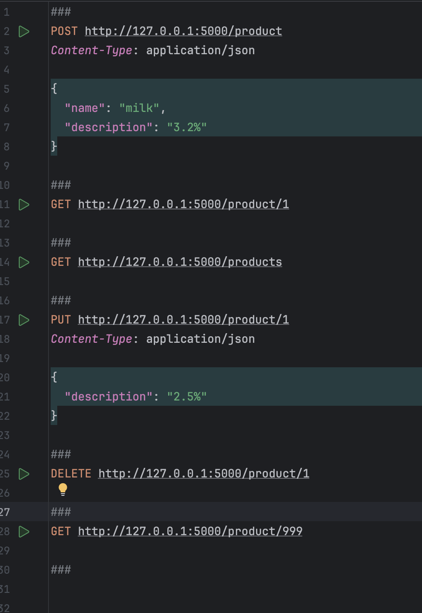
  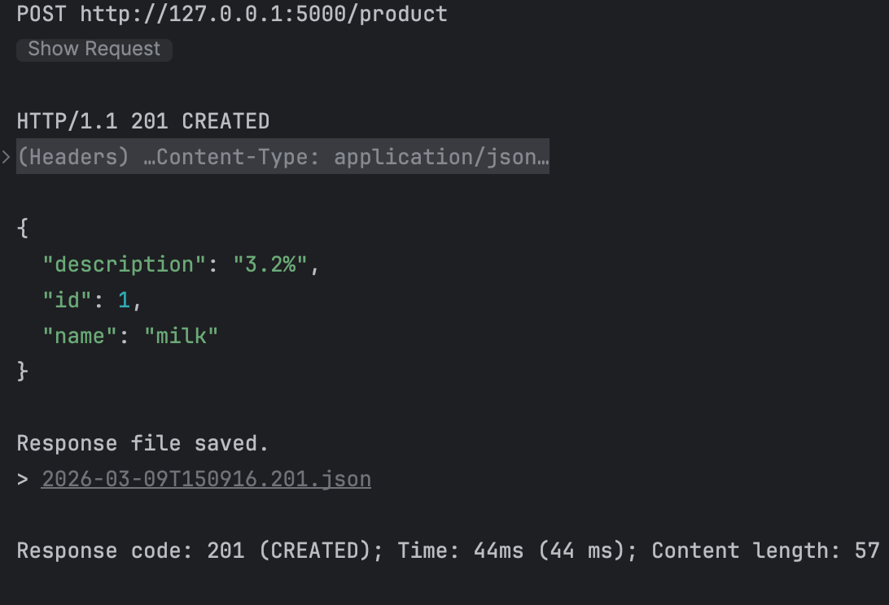
  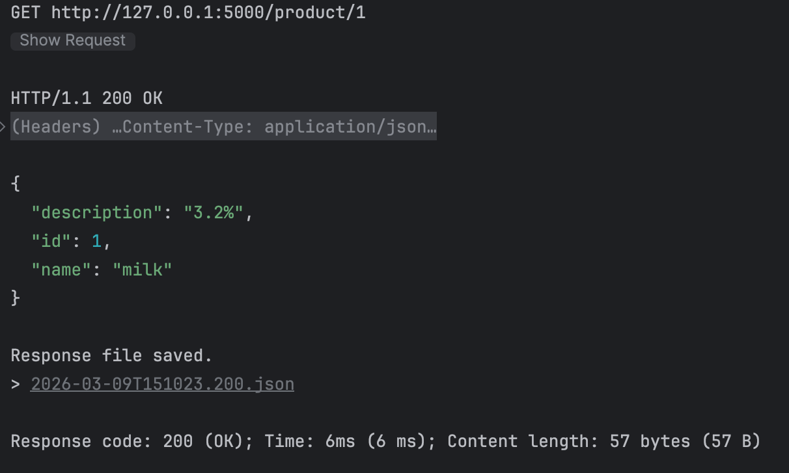 
  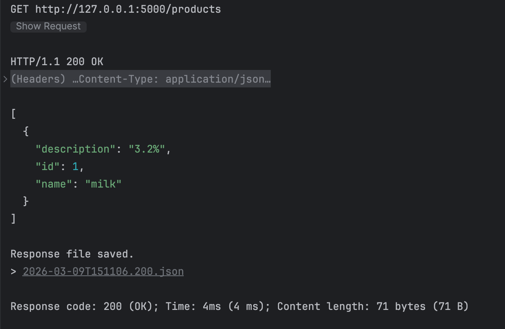
  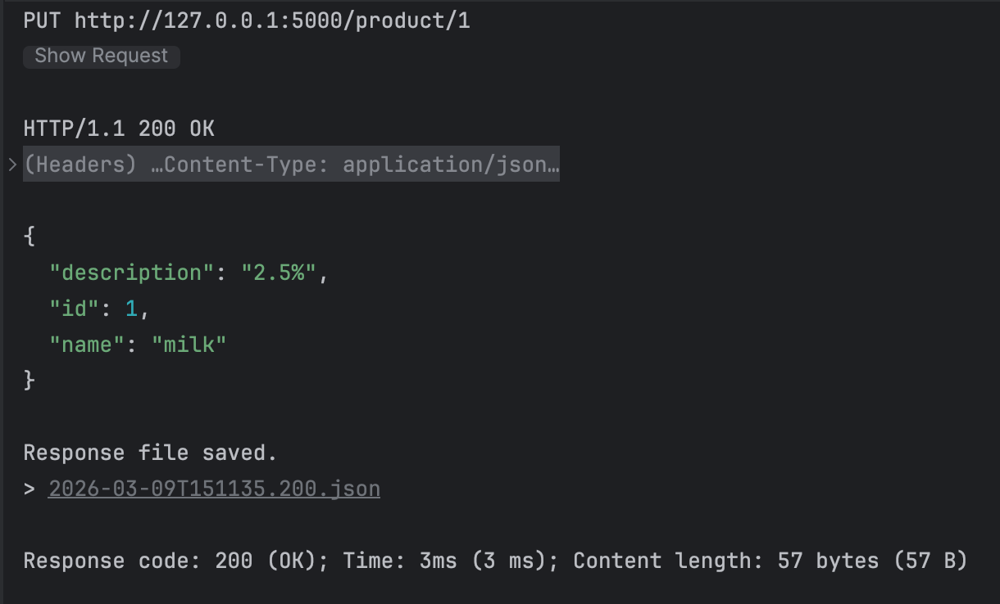
  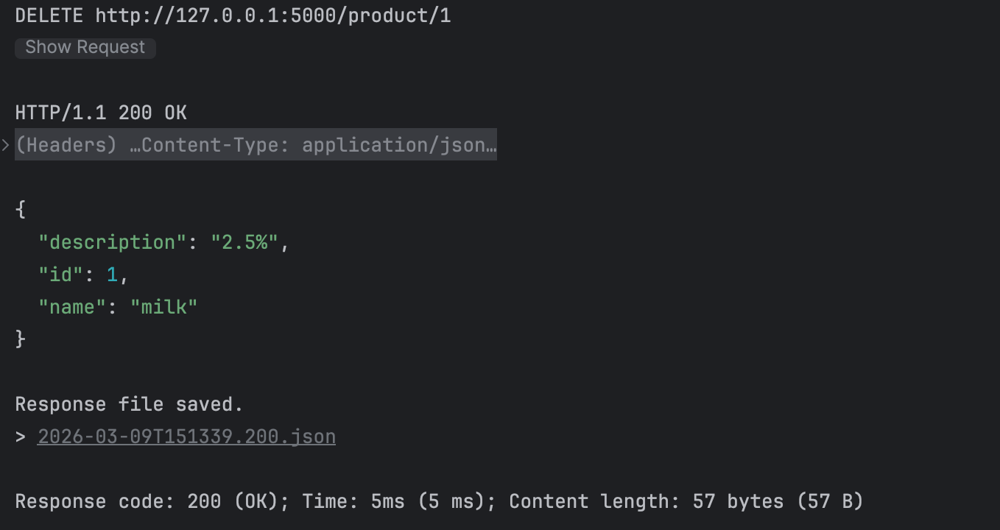
  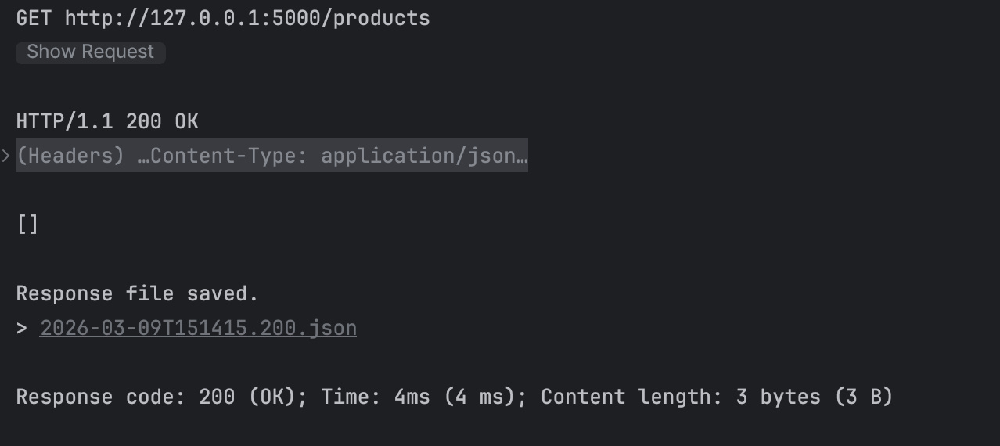
  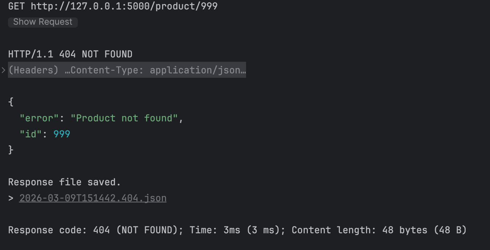


### Задание В (4 балла)
Пусть ваш продукт также имеет иконку (небольшую картинку). Формат иконки (картинки) может
быть любым на ваш выбор. Для простоты будем считать, что у каждого продукта картинка одна.

Добавьте две новые операции:
1. Загрузить иконку:
   - `POST product/{product_id}/image`
   - Запрос содержит бинарный файл — изображение  
     
2. Получить иконку:
   - `GET product/{product_id}/image`
   - В ответе передаётся только сама иконка  
     

Измените операции в Задании А так, чтобы теперь схема продукта содержала сведения о загруженной иконке, например, имя файла или путь:
```json
"icon": "string"
```

#### Демонстрация работы
  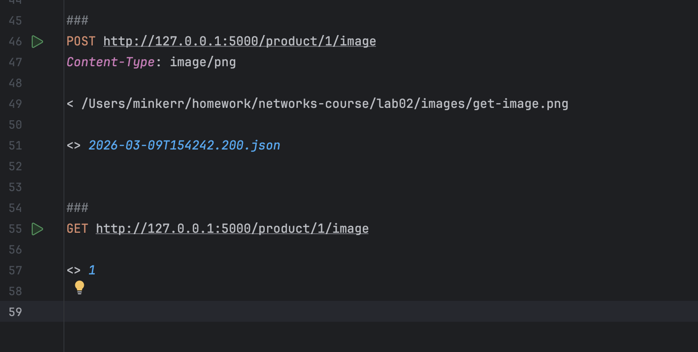
  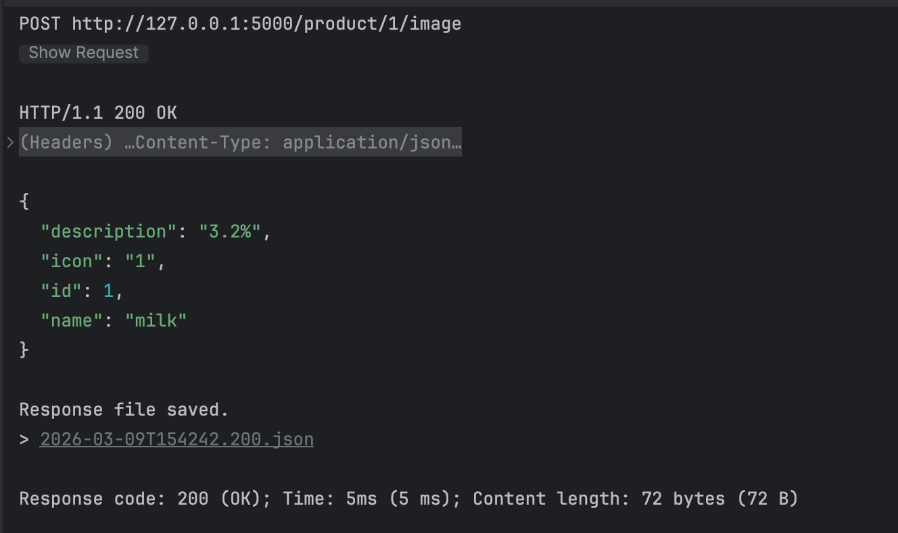
  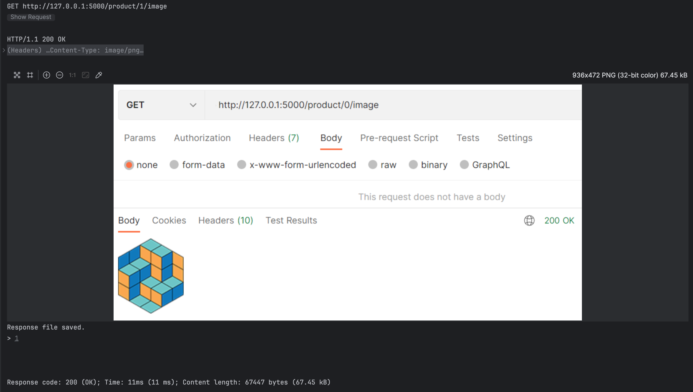
  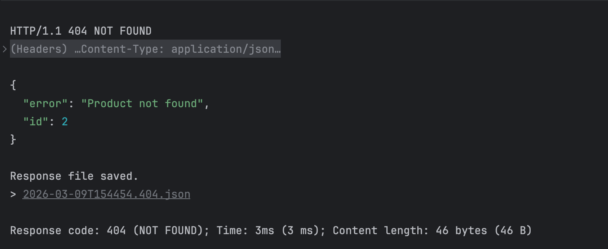

---

_(*) В последующих домашних заданиях вам будет предложено расширить функционал данного сервиса._

## Задачи

### Задача 1 (2 балла)
Общая (сквозная) задержка прохождения для одного пакета от источника к приемнику по пути,
состоящему из $N$ соединений, имеющих каждый скорость $R$ (то есть между источником и
приемником $N - 1$ маршрутизатор), равна $d_{\text{сквозная}} = N \dfrac{L}{R}$
Обобщите данную формулу для случая пересылки количества пакетов, равного $P$.

#### Решение
1) $P$-й пакет выходит в момент $(P-1) \cdot L/R$. доходит до приёмника через $N \cdot L/R$ после выхода.
2) $(P-1) \cdot \dfrac{L}{R} + N \cdot \dfrac{L}{R} = (N+P-1) \cdot \dfrac{L}{R}$.

**Ответ:** $d = (N + P - 1) \cdot \dfrac{L}{R}$.

### Задача 2 (2 балла)
Допустим, мы хотим коммутацией пакетов отправить файл с хоста A на хост Б. Между хостами установлены три
последовательных канала соединения со следующими скоростями передачи данных:
$R_1 = 200$ Кбит/с, $R_2 = 3$ Мбит/с и $R_3 = 2$ Мбит/с.
Сколько времени приблизительно займет передача на хост Б файла размером $5$ мегабайт?
Как это время зависит от размера пакета?

#### Решение
1) $5 \cdot 8 = 40$ Мбит. файл
2) первый канал --- узкое место (самый медленный)
3) $40 / 0{,}2 = 200$ с. время по первому каналу 

**Ответ:** $200$ с. Время растёт пропорционально с размером файла

### Задача 3 (2 балла)
Предположим, что пользователи делят канал с пропускной способностью $2$ Мбит/с. Каждому
пользователю для передачи данных необходима скорость $100$ Кбит/с, но передает он данные
только в течение $20$ процентов времени использования канала. Предположим, что в сети всего $60$
пользователей. А также предполагается, что используется сеть с коммутацией пакетов. Найдите
вероятность одновременной передачи данных $12$ или более пользователями.

#### Решение
1) $p = 0{,}2$, $1-p = 0{,}8$. вероятность, что пользователь передаёт/не передаёт
2) $\sum_{k=0}^{11} \binom{60}{k} \cdot 0.2^k \cdot 0.8^{60-k}$. одновременно передаёт
3) $P(k \leq 11) = 0{,}463$.
4) $P(k \geq 12) = 1 - 0{,}463 = 0{,}537$.

**Ответ:** $0{,}537$.

### Задача 4 (2 балла)
Пусть файл размером $X$ бит отправляется с хоста А на хост Б, между которыми три линии связи и
два коммутатора. Хост А разбивает файл на сегменты по $S$ бит каждый и добавляет к ним
заголовки размером $80$ бит, формируя тем самым пакеты длиной $L = 80 + S$ бит. Скорость
передачи данных по каждой линии составляет $R$ бит/с. Загрузка линий мала, и очередей пакетов
нет. При каком значении $S$ задержка передачи файла между хостами А и Б будет минимальной?
Задержкой распространения сигнала пренебречь.

#### Решение
1) $P = \dfrac{X}{S}$ пакетов.
2) $L = 80 + S$. длина
3) $\dfrac{L}{R} = \dfrac{80+S}{R}$. время одного пакета
3) $d = (N + P - 1) \cdot \dfrac{L}{R}$. задержка. см з. 1
4) $d = \left(3 + \dfrac{X}{S} - 1\right) \cdot \dfrac{80+S}{R} = \left(2 + \dfrac{X}{S}\right) \cdot \dfrac{80+S}{R}$.
5) производная по $S$ от $(2 + X/S)(80+S) = -\dfrac{X}{S^2}(80+S) + \left(2+\dfrac{X}{S}\right) = 0$. 
6) $-X(80+S) + 2S^2 + XS = 0$
7) $S^2 = 40X$.

**Ответ:** $S = \sqrt{40X}$ бит.

### Задание 5 (2 балла)
Рассмотрим задержку ожидания в буфере маршрутизатора. Обозначим через $I$ интенсивность
трафика, то есть $I = \dfrac{L a}{R}$.
Предположим, что для $I < 1$ задержка ожидания вычисляется как $\dfrac{I \cdot L}{R (1 – I)}$. 
1. Напишите формулу для общей задержки, то есть суммы задержек ожидания и передачи.
2. Опишите зависимость величины общей задержки от значения $\dfrac{L}{R}$.

#### Решение
1) $\dfrac{I \cdot L}{R(1-I)}$, где $I = \dfrac{La}{R}$.
2) $d = \dfrac{L}{R} + \dfrac{I \cdot L}{R(1-I)} = \dfrac{L}{R} \left(1 + \dfrac{I}{1-I}\right) = \dfrac{L}{R} \cdot \dfrac{1}{1-I}$.

**Ответ:** $d = \dfrac{L/R}{1-I}$.

1) Пусть $T = L/R$. Тогда $d = \dfrac{T}{1-I}$, и $I = \dfrac{La}{R} = aT$. 
2) $d = \dfrac{T}{1-aT}$. 
3) При росте $T$ знаменатель $1 - aT$ уменьшается, значит $d$ растёт

**Ответ:** Общая задержка растёт с увеличением $L/R$
